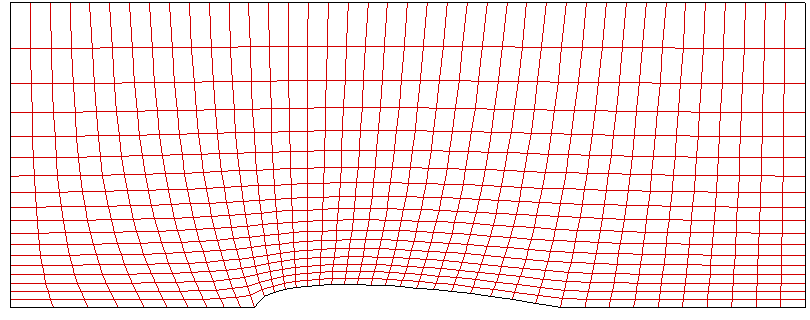
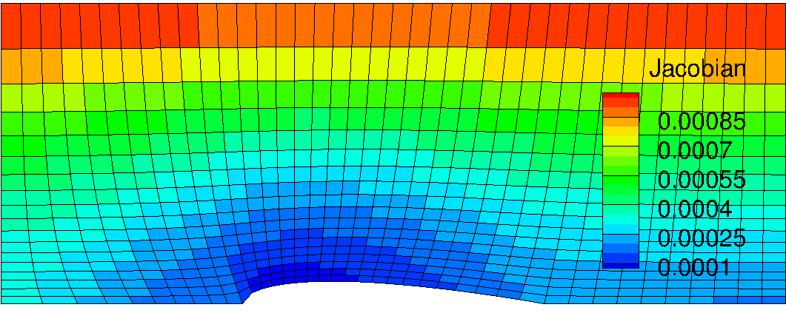

Results summary
===============

Preliminary test
----------------

Under construction

Grid #1
-------

The figure below shows the grid point alignments made by the GridGen code with algebraic grid and uniform grid spacing assumptions at every boundary edges. The interior points were generated by applying linear interpolation based two opposed pre-specified grid points. Thus the current grid has almost straight lines but with normally inclined angles, which makes a little skewed cells in the leading edge of the air foil. Also we can find a sudden change in cell volume across two grid lines anchored in leading and trailing edges of the airfoil.

.. image:: ./images/mesh_pr01.png
   :width: 60%

<Figure: Grid points alignment of Grid #1>

The more quantitative analysis is available with grid Jacobian contour on the current mesh. The 'Jacobian' here is inherently defined as determinant of inverse grid Jacobian matrix at every single grid point. Thus, it indicates a grid cell volume in 3D and cell area in 2D. Here, since the currently used Jacobian is defined at 3-dimensional coordinates, the grid shown below was made with a width of 0.1 m in :math:`y` direction , however, it does not have grid resolution in this direction.

.. image:: ./images/Jacobian_pr01.png
   :width: 59%

<Figure: Inverse Grid Jacobian distribution of Grid #1>

Grid #2
-------

The second trial was made on the point spacing stretching with algebraic grid alignment. This grid is based on the same approach for Grid #1. The only change in this grid was to apply gradually clustered grid points downward at left and right boundaries. Note that the linear interpolation of :math:`x`-coordinates along the each vertical line is made only on the basis of j-index as formulated earlier. The effect of this is to make x coordinate shifting along the vertical line is identical for every point. Thus it leads to the somewhat much shifting for concentrated grid points in :math:`y`-direction. Now we can observe non-linear grid lines in j-direction. This makes grid less skewer in the leading edge of the airfoil.

.. image:: ./images/mesh_pr02.png
   :width: 60%

<Figure: Grid points alignment of Grid #2>

The grid Jacobian contour is shown below. Applying grid stretching along the :math:`y` direction gives big cell volume distribution gradually upper. Change in volume along the bottom edge looks more less significant even in the leading edge. Since, however, the grid spacing is not changed in :math:`x` direction from Grid #1 alignment, we could expect some error in flux throught the cell face at leading edge achored point. The same situation happens at the trailing point of the airfoil. In some point, this grid alignment is more reliable for this geometry because the significantly high gradient of flow velocity will only take place in the leading edge so that we need more dense grid points in this reagion.

.. image:: ./images/Jacobian_pr02.png
   :width: 59%

<Figure: Inverse Grid Jacobian distribution of Grid #2>

Grid #3
-------

Grid images will be shown and anaysis will be added here!!

.. image:: ./images/mesh_pr03.png
   :width: 60%

<Figure: Grid points alignment of Grid #3>

.. image:: ./images/Jacobian_pr03.png
   :width: 59%

<Figure: Inverse Grid Jacobian distribution of Grid #3>

Grid #4
-------

Grid images will be shown and anaysis will be added here!!

.. image:: ./images/mesh_pr04.png
   :width: 60%

<Figure: Grid points alignment of Grid #4>

.. image:: ./images/Jacobian_pr04.png
   :width: 59%

<Figure: Inverse Grid Jacobian distribution of Grid #4>

Grid #5
-------

Grid images will be shown and anaysis will be added here!!

<Figure: Grid points alignment of Grid #4>

 
 +----------------------------------------+-----------------------------------------+
 | - No stretched 'cy = 0.001'            | - Stretching factor 'cy3 = -10' applied |
 |                                        |                                         |
 | .. image:: ./images/NoStretchedPi.png  | .. image:: ./images/Stretched-10Pi.png  |
 |    :width: 70%                         |    :width: 70%                          |
 |                                        |                                         |
 +----------------------------------------+-----------------------------------------+

<Figure: Change in :math:`\phi` by stretching factor 'cy3'>

<Figure: Inverse Grid Jacobian distribution of Grid #4>
