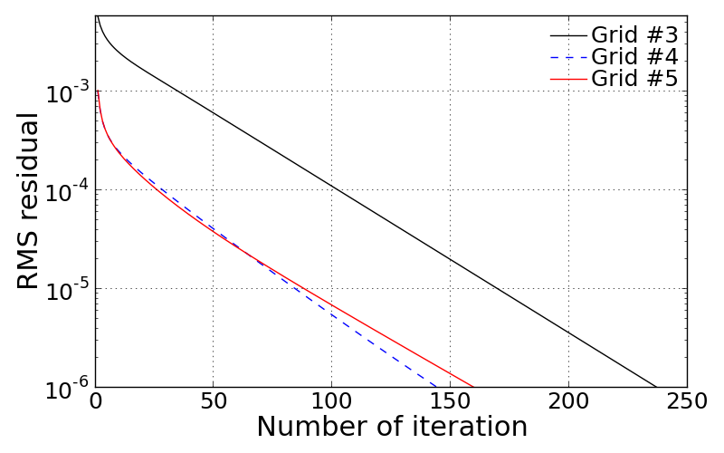

Results summary
===============

Grid #1: Algebraic grid with non-clustered points in :math:`z`
--------------------------------------------------------------

The figure below shows the grid point alignments made by the GridGen code with algebraic grid and uniform grid spacing assumptions at every boundary edges. The interior points were generated by applying linear interpolation based two opposed pre-specified grid points. Thus the current grid has almost straight lines but with normally inclined angles, which makes a little skewed cells in the leading edge of the air foil. Also we can find a sudden change in cell volume across two grid lines anchored in leading and trailing edges of the airfoil.

.. image:: ./images/mesh_pr01.png
   :width: 60%

<Figure: Grid points alignment of Grid #1>

The more quantitative analysis is available with grid Jacobian contour on the current mesh. The 'Jacobian' here is inherently defined as determinant of inverse grid Jacobian matrix at every single grid point. Thus, it indicates a grid cell volume in 3D and cell area in 2D. Here, since the currently used Jacobian is defined at 3-dimensional coordinates, the grid shown below was made with a width of 0.1 m in :math:`y` direction , however, it does not have grid resolution in this direction.

.. image:: ./images/Jacobian_pr01.png
   :width: 59%

<Figure: Inverse Grid Jacobian distribution of Grid #1>

Grid #2: Algebraic grid with clustered points in :math:`z`
----------------------------------------------------------

The second trial was made on the point spacing stretching with algebraic grid alignment. This grid is based on the same approach for Grid #1. The only change in this grid was to apply gradually clustered grid points downward at left and right boundaries. Note that the linear interpolation of :math:`x`-coordinates along the each vertical line is made only on the basis of j-index as formulated earlier. The effect of this is to make x coordinate shifting along the vertical line is identical for every point. Thus it leads to the somewhat much shifting for concentrated grid points in :math:`y`-direction. Now we can observe non-linear grid lines in j-direction. This makes grid less skewer in the leading edge of the airfoil.

.. image:: ./images/mesh_pr02.png
   :width: 60%

<Figure: Grid points alignment of Grid #2>

The grid Jacobian contour is shown below. Applying grid stretching along the :math:`y` direction gives big cell volume distribution gradually upper. Change in volume along the bottom edge looks more less significant even in the leading edge. Since, however, the grid spacing is not changed in :math:`x` direction from Grid #1 alignment, we could expect some error in flux throught the cell face at leading edge achored point. The same situation happens at the trailing point of the airfoil. In some point, this grid alignment is more reliable for this geometry because the significantly high gradient of flow velocity will only take place in the leading edge so that we need more dense grid points in this reagion.

.. image:: ./images/Jacobian_pr02.png
   :width: 59%

<Figure: Inverse Grid Jacobian distribution of Grid #2>

Grid #3: Elliptic grid with clustered points in :math:`z` & no control terms
----------------------------------------------------------------------------

The grid shown below is made by the elliptic Poisson equations with clustered grid points in vertical direction. As expected, the Poisson equation with no control terms draws grid aliments resembled with iso-stream lines and iso-potention lines around the airfoil body. This is because the set of Posson equation is exactly same as a set of stream function and potention function when the control terms are ignored.

.. image:: ./images/mesh_pr03.png
   :width: 60%

<Figure: Grid points alignment of Grid #3>

However, it is expected that curved lines right at the inlet edge and outlet edge are not aligned with the inlet flow. This misaligment could cause the flux of flow properties across the k-constant lines and thus it would make numerical errors. From the grid Jacobian contour result, sudden change in cell volume along the flow direction can be found. Maximum and minimum cell volume are found at left and right top edge and bottom edge, respectively.

.. image:: ./images/Jacobian_pr03.png
   :width: 59%

<Figure: Inverse Grid Jacobian distribution of Grid #3>

Grid #4: Elliptic grid with clustered points in :math:`z` & control terms
-------------------------------------------------------------------------

The problem that arise in Grid #3 case was able to be resolved by adding control terms for Poisson equation. From the mesh shape of Grid #4 shown below, it can be found that adding control terms plays an important role in improving grid orthogonality. Thus now we have better grid aligment especially along the flow stream lines that can be expected intuitively. Even though there is a significant change in grid size along the vertical line, it may not act as a critical issue for numerical accuracy because the flux in vertical direction will be quite important.

.. image:: ./images/mesh_pr04.png
   :width: 60%

<Figure: Grid points alignment of Grid #4>

In this grid, we can find a severely skewed cell in the leading edge of airfoil. This is more severe than Grid #3. Making orthogonality for the vertical lines cause more vertically stand i-constant lines, hence it leads to the sharp angle between airfoil arc and i-constant line anchored at the leading edge.

.. image:: ./images/Jacobian_pr04.png
   :width: 59%

<Figure: Inverse Grid Jacobian distribution of Grid #4>

Grid #5: Improved grid quality
------------------------------

We observed several issues in grid quality stepping through the Grid #1 ~ #4. Since Grid #4 shows better quality than others, the new approach started with the method employed in Grid #4. The unresolved issues in Grid #4 can be summarized as followings:

- Sudden chanege in grid cell size at the leading edge point and trailing edge point.

- Skewness becomes more severe when applying control terms especially at leading edge point.

In this approach, an effort was made to resolve the above issues. First of all, to make the smooth change in grid cell size, stretching formula was employed along the FE, ED, and DC lines. As already mentioned earlier, this can be controlled by adding 'cy' values in 'input.dat' file. The following shows a part of 'input.dat' which is applied to Grid #5::

  # Grid clustering:
  # cy1: stretched grid in z
  # cy2: stretched Pi in z
  # cy3: stretched Psi in x
  # cy4: stretched grid along FE
  # cy5: stretched grid along ED
  # cy6: stretched grid along DC
  cy1             2.0
  cy2             -10.0
  cy3             0.001
  cy4             -1.2
  cy5             1.0
  cy6             0.001

.. image:: ./images/mesh_pr05.png
   :width: 60%

<Figure: Grid points alignment of Grid #4>

The 'cy1' remains unchanged but 'cy4', 'cy5', and 'cy6' are aditionally defined to change the grid spacing along the FE, airfoil arc, and DC, respectively. Here, negative value makes the grid points more concentrated towards the right corner. As a result, by adding proper values for these parameters, sudden change in grid size was avoided. Moreover, this results in more grid points near the leading edge. This is better grid alignment because we can intuitively expect that there is more significant change in flow properties when flow meet the leading edge.

In this approach, the grid spacing along the top edge (A-B) is left uniform because the flow properties will not experience significant change. Only significant change we care about will take place only in the leading edge.

.. table::
   :class: borderless
 
   +----------------------------------------+-----------------------------------------+
   | - No stretched 'cy = 0.001'            | - Stretching factor 'cy2 = -10' applied |
   +----------------------------------------+-----------------------------------------+
   | .. image:: ./images/NoStretchedPi.png  | .. image:: ./images/Stretched-10Pi.png  |
   |    :width: 80%                         |    :width: 80%                          |
   |                                        |                                         |
   +----------------------------------------+-----------------------------------------+

<Figure: Change in :math:`\phi` by stretching factor 'cy3'>

As can be found above, control terms can be aditionally controlled by changing 'cy2' and 'cy3'. The zoomed-in grid shown below confirmed an effect of changing 'cy3' value on the distribution of :math:`\phi` value. Less :math:`\phi` value helps the grid alignment resemble with the Grid #3, which shows the less skew cell in the leading edge.

.. image:: ./images/Jacobian_pr05.png
   :width: 59%

<Figure: Inverse Grid Jacobian distribution of Grid #4>

From the Jacobian contour, we can find that the smallest Jacobian value has been shifted towards the leading edge. This is because the Grid #5 has more grid points near this region. It is expected that the significant flow property change will be covered by blue and dark blue colored region in the above grid.

Convergence check: RMS residual log
+++++++++++++++++++++++++++++++++++

A figure shown below illustrates the convergence history as a function of iteration number. This log is made only for the Elliptic grid solution because it is stored while Thomas method is being looped. Every cases meet the pre-specified RMS criterion. Here we can find that adding control terms helps fast convergence.

